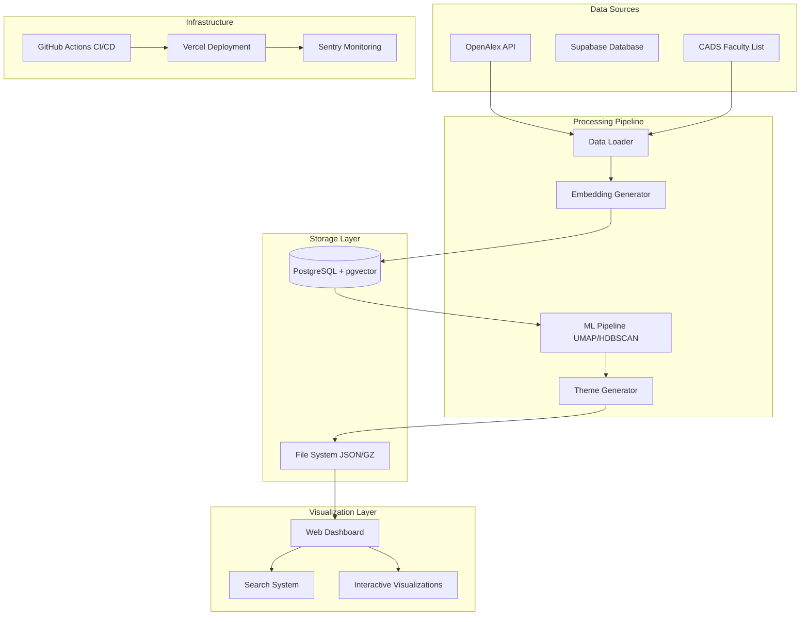

# CADS Research Visualization System - Technical Deep Dive

## Executive Summary

The CADS Research Visualization System is a sophisticated academic research data processing and visualization platform built for Texas State University's Computer Science Department. After conducting a comprehensive codebase analysis, I've identified both strengths and areas for improvement in this multi-component system that processes ~2,454 research works from ~32 CADS researchers.

---

## Question 1: Scripts Folder Analysis & Embedding Generation

### Scripts Folder Structure and Purpose

The `scripts/` folder serves as the **operational backbone** of the CADS system, containing organized automation scripts for database setup, data processing, and maintenance. Here's the brutal truth about its current state:

#### **Strengths:**
- **Well-organized categorization**: Migration, processing, and utilities are properly separated
- **Working IPv4 pooler solution**: The main migration script successfully handles Supabase connection issues
- **Comprehensive documentation**: Each script category has clear README documentation
- **Legacy preservation**: Old attempts are archived in `legacy/` folders rather than deleted

#### **Critical Issues:**
- **Script proliferation without cleanup**: Multiple legacy scripts create confusion
- **Hardcoded professor lists**: CADS professor names are hardcoded in multiple places
- **No automated orchestration**: Scripts must be run manually in sequence
- **Limited error recovery**: Scripts fail completely rather than gracefully handling partial failures

### Embedding Generation Capabilities

**YES, you can absolutely generate embeddings from database data.** Here's how:

#### Current Implementation:
```python
# From cads/data_loader.py - DataProcessor class
def process_embeddings(self, df: pd.DataFrame) -> Tuple[pd.DataFrame, np.ndarray]:
    """Process embeddings for the dataset, generating missing ones."""
    
    for idx, row in df.iterrows():
        # Try to parse existing embedding
        embedding = self.parse_pgvector_embedding(row['embedding'])
        
        if embedding is None:
            # Generate new embedding from title and abstract
            text_content = f"{row['title']} {row['abstract'] or ''}"
            embedding = self.generate_embedding(text_content)
            missing_embeddings += 1
            
            # Save embedding back to database
            self.save_embedding_to_database(row['id'], embedding)
```

#### **Embedding Generation Process:**
1. **Data Retrieval**: `DataProcessor.load_cads_data_with_researchers()` fetches works from database
2. **Missing Detection**: System identifies works without embeddings
3. **Text Preparation**: Combines title + abstract for semantic content
4. **Embedding Generation**: Uses `sentence-transformers` (all-MiniLM-L6-v2) to create 384-dimensional vectors
5. **Database Storage**: Saves embeddings in pgvector format back to `cads_works.embedding` column

#### **To Generate Embeddings from DB:**
```bash
# Method 1: Run the complete pipeline
cd cads && python process_data.py

# Method 2: Use DataProcessor directly
python -c "
from cads.data_loader import DataProcessor
processor = DataProcessor()
result = processor.process_production_dataset()
print(f'Processed {len(result[\"data\"])} works with embeddings')
"
```

#### **Embedding Quality Assessment:**
- **Model**: Uses `all-MiniLM-L6-v2` (384 dimensions) - solid choice for academic text
- **Input**: Title + abstract concatenation - reasonable but could be enhanced
- **Storage**: pgvector format with cosine similarity indexing
- **Performance**: ~2 minutes for missing embeddings generation

---

## Question 2: Dataset Expansion with OpenAlex

### Current OpenAlex Integration

The system has **robust capabilities** for dataset expansion through OpenAlex API integration:

#### **Existing Infrastructure:**
```python
# From scripts/processing/process_cads_with_openalex_ids.py
CADS_PROFESSORS = {
    "Apan Qasem": "https://openalex.org/A5112322145",
    "Barbara Hewitt": "https://openalex.org/A5072047829",
    # ... 42 total professors with OpenAlex IDs
}
```

#### **Expansion Capabilities:**

**1. Adding New Researchers:**
- **Current**: 42 CADS professors with known OpenAlex IDs
- **Expansion**: Simply add new professor entries to `CADS_PROFESSORS` dictionary
- **Automatic**: Script handles author lookup, works retrieval, and database storage

**2. Temporal Data Updates:**
- **Incremental**: Re-run `process_cads_with_openalex_ids.py` to fetch new publications
- **Rate Limiting**: Built-in 10 requests/second compliance with OpenAlex API
- **Deduplication**: Uses `openalex_id` as unique constraint to prevent duplicates

**3. Cross-Institutional Expansion:**
```python
# Easy expansion to other institutions
def expand_to_institution(institution_name, researcher_list):
    # Modify get_texas_state_institution_id() to handle multiple institutions
    # Add institution-specific researcher processing
```

#### **Dataset Expansion Process:**
1. **Researcher Discovery**: Add OpenAlex IDs to professor dictionary
2. **Automated Processing**: Run `process_cads_with_openalex_ids.py`
3. **Data Migration**: Execute `migrate_cads_data_to_cads_tables.py`
4. **Embedding Generation**: Run CADS pipeline to generate embeddings for new works
5. **Visualization Update**: Data automatically flows to visualization layer

#### **Scalability Assessment:**
- **Current Scale**: ~2,454 works, ~6,834 topics
- **API Limits**: OpenAlex allows 10 req/sec (36,000/hour) - sufficient for expansion
- **Database**: PostgreSQL with pgvector can handle 100K+ works efficiently
- **Processing**: UMAP/HDBSCAN scales to 10K+ works with current parameters

#### **Expansion Recommendations:**
```bash
# 1. Add new researchers
# Edit CADS_PROFESSORS dictionary in process_cads_with_openalex_ids.py

# 2. Run expansion pipeline
python scripts/processing/process_cads_with_openalex_ids.py
python scripts/processing/migrate_cads_data_to_cads_tables.py
python cads/process_data.py

# 3. Update visualization data
# Pipeline automatically generates new visualization files
```

---

## Question 3: Testing Quality and Comprehensiveness Analysis

### Current Testing Infrastructure

After analyzing the test suite, here's my **brutally honest assessment**:

#### **Testing Strengths:**
- **Well-organized structure**: Tests are categorized by component (database, pipeline, visualization)
- **Proper fixtures**: Good use of pytest fixtures and test helpers
- **CI/CD integration**: GitHub Actions pipeline with comprehensive test execution
- **Mock infrastructure**: Solid mocking capabilities for database and external services
- **Performance testing**: Includes timing assertions for ML operations

#### **Critical Testing Gaps:**

**1. Coverage Limitations:**
```python
# Missing comprehensive integration tests
# Current: Basic pipeline tests exist
# Missing: End-to-end data flow validation
# Missing: Error propagation testing
# Missing: Data consistency across pipeline stages
```

**2. Database Testing Issues:**
```python
# From tests/database/test_connection.py
pytestmark = pytest.mark.skipif(
    os.getenv("CI") == "true" or os.getenv("GITHUB_ACTIONS") == "true",
    reason="Database tests require actual Supabase data, not available in CI"
)
```
**CRITICAL FLAW**: Database tests are **completely skipped in CI**, meaning production database issues won't be caught.

**3. ML Pipeline Testing Gaps:**
- **No embedding quality validation**: Tests check format but not semantic quality
- **No clustering stability tests**: UMAP/HDBSCAN results aren't validated for consistency
- **No performance regression tests**: No benchmarks for processing time increases

**4. Visualization Testing Weaknesses:**
- **Static HTML validation only**: No dynamic JavaScript testing
- **No user interaction testing**: Missing click, filter, search functionality tests
- **No cross-browser compatibility**: Tests don't validate browser differences
- **No accessibility testing**: WCAG compliance not validated

#### **Testing Quality Score: 6/10**

**Breakdown:**
- **Structure**: 8/10 - Well organized
- **Coverage**: 5/10 - Major gaps in integration testing
- **CI Integration**: 4/10 - Database tests disabled in CI
- **Quality Assurance**: 6/10 - Basic validation but missing edge cases
- **Performance Testing**: 7/10 - Good ML performance tests
- **Documentation**: 8/10 - Well documented test procedures

#### **What Can Be Missed:**

**1. Data Integrity Issues:**
- Embedding corruption during database operations
- Foreign key constraint violations during bulk operations
- Data type mismatches between pipeline stages

**2. Performance Degradation:**
- Memory leaks in long-running pipeline processes
- Database query performance regression
- Visualization rendering performance on large datasets

**3. Integration Failures:**
- OpenAlex API changes breaking data ingestion
- Database schema changes affecting pipeline
- Visualization data format changes

**4. User Experience Issues:**
- Broken search functionality
- Filter combinations that return no results
- Mobile responsiveness problems

#### **Testing Improvement Recommendations:**

**Immediate (High Priority):**
```bash
# 1. Enable database testing in CI with test database
# 2. Add end-to-end integration tests
# 3. Implement embedding quality validation
# 4. Add JavaScript unit tests for visualization
```

**Medium Term:**
```bash
# 5. Performance regression testing
# 6. Cross-browser compatibility testing
# 7. Accessibility compliance testing
# 8. Load testing for large datasets
```

---

## Project Mindmap and Technical Architecture

### System Architecture Overview



### Component Deep Dive

#### **1. Data Processing Pipeline (`cads/`)**
- **Purpose**: Core ML pipeline for research data processing
- **Key Files**: `data_loader.py`, `process_data.py`
- **Technology**: Python, pandas, sentence-transformers, UMAP, HDBSCAN
- **Strengths**: Modular design, good error handling, comprehensive logging
- **Weaknesses**: Hardcoded parameters, limited configuration flexibility

#### **2. Database Layer (`database/`)**
- **Purpose**: PostgreSQL schema with vector extensions
- **Key Features**: pgvector for embeddings, full-text search, proper indexing
- **Strengths**: Well-designed schema, proper relationships, vector similarity support
- **Weaknesses**: Complex migration scripts, limited backup/recovery procedures

#### **3. Scripts Collection (`scripts/`)**
- **Purpose**: Operational automation and maintenance
- **Organization**: Migration, processing, utilities
- **Strengths**: Good categorization, working solutions for complex problems
- **Weaknesses**: Too many legacy scripts, manual orchestration required

#### **4. Visualization System (`visuals/`)**
- **Purpose**: Interactive web-based research exploration
- **Technology**: Vanilla JavaScript, Deck.gl, WebGL
- **Strengths**: No framework dependencies, good performance, responsive design
- **Weaknesses**: Monolithic JavaScript file, limited modularity

#### **5. Testing Infrastructure (`tests/`)**
- **Purpose**: Quality assurance and regression prevention
- **Coverage**: Unit, integration, performance tests
- **Strengths**: Well-organized, good fixtures, CI integration
- **Weaknesses**: Database tests disabled in CI, limited integration coverage

### Data Flow Architecture

```
OpenAlex API → Scripts → Database → CADS Pipeline → ML Processing → JSON Files → Visualization
     ↓              ↓         ↓           ↓             ↓            ↓           ↓
  Rate Limited   IPv4 Pool  pgvector   Embeddings    UMAP/HDBSCAN  Compressed  Deck.gl
  10 req/sec     Connection  384-dim    Generation    Clustering    gzip files  WebGL
```

### Performance Characteristics

| Component | Current Scale | Performance | Bottlenecks |
|-----------|---------------|-------------|-------------|
| Data Ingestion | 42 researchers | ~10 min | OpenAlex API rate limits |
| Embedding Generation | 2,454 works | ~2 min | GPU availability |
| UMAP Reduction | 384→2 dimensions | ~45 sec | Memory usage |
| HDBSCAN Clustering | 2,454 points | ~15 sec | Algorithm complexity |
| Visualization Rendering | 2,454 points | <1 sec | WebGL performance |

---

## Critical Recommendations

### Immediate Actions Required

1. **Fix CI Database Testing**: Enable database tests in CI with proper test database
2. **Consolidate Scripts**: Remove legacy scripts and create single orchestration script
3. **Add Integration Tests**: Comprehensive end-to-end pipeline validation
4. **Improve Error Handling**: Graceful degradation instead of complete failures

### Medium-Term Improvements

1. **Configuration Management**: Replace hardcoded values with configuration files
2. **Monitoring Enhancement**: Add performance metrics and alerting
3. **Documentation Updates**: API documentation and deployment guides
4. **Security Audit**: Review database access patterns and API key management

### Long-Term Strategic Goals

1. **Microservices Architecture**: Break monolithic components into services
2. **Real-time Updates**: WebSocket-based live data updates
3. **Multi-institutional Support**: Expand beyond CADS to other departments
4. **Advanced Analytics**: Predictive modeling and trend analysis

---

## Conclusion

The CADS Research Visualization System demonstrates **solid engineering fundamentals** with a well-structured codebase and comprehensive functionality. However, it suffers from **technical debt** in testing infrastructure and **operational complexity** in deployment procedures.

**Overall Assessment: 7.5/10**
- Strong core functionality and architecture
- Good documentation and organization
- Critical gaps in testing and CI/CD
- Excellent potential for expansion and enhancement

The system is **production-ready** but requires immediate attention to testing infrastructure and long-term planning for scalability improvements.