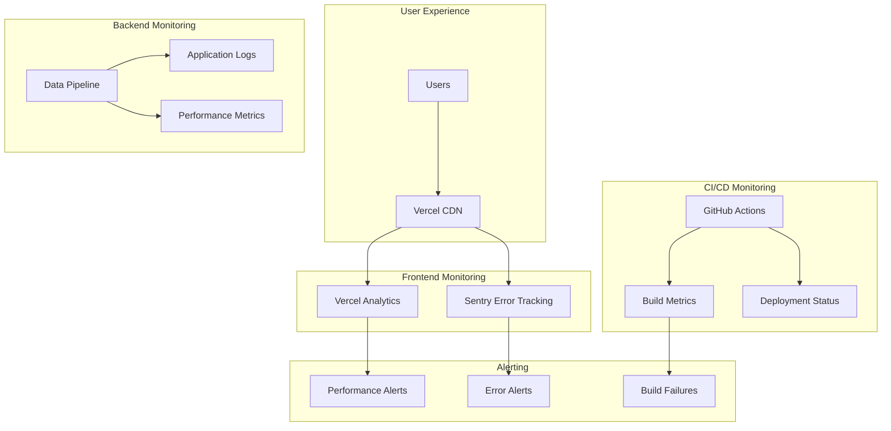

# Monitoring and Metrics Interpretation Guide

This guide explains how to interpret metrics, alerts, and monitoring data from the CADS Research Visualization System's integrated monitoring stack (Sentry, Vercel Analytics, and GitHub Actions).

## 📊 Monitoring Stack Overview

The system uses three primary monitoring tools:



## 🎯 Vercel Analytics Metrics

### Core Web Vitals

#### Largest Contentful Paint (LCP)
**What it measures**: Time until the largest content element is rendered

**Healthy Ranges**:
- ✅ **Good**: < 2.5 seconds
- ⚠️ **Needs Improvement**: 2.5 - 4.0 seconds  
- ❌ **Poor**: > 4.0 seconds

**Interpretation**:
```
LCP = 1.8s → ✅ Excellent loading performance
LCP = 3.2s → ⚠️ Users may notice slow loading
LCP = 5.1s → ❌ Significant user experience issues
```

**Common Causes of Poor LCP**:
- Large visualization data files not compressed
- Slow server response times
- Render-blocking JavaScript
- Large images or assets

**Optimization Actions**:
```bash
# Check data file compression
ls -lh visuals/public/data/*.gz

# Verify gzip serving
curl -H "Accept-Encoding: gzip" https://your-domain.com/data/visualization-data.json.gz

# Monitor file sizes
du -h visuals/public/data/
```

#### First Input Delay (FID)
**What it measures**: Time from first user interaction to browser response

**Healthy Ranges**:
- ✅ **Good**: < 100ms
- ⚠️ **Needs Improvement**: 100 - 300ms
- ❌ **Poor**: > 300ms

**Interpretation**:
```
FID = 45ms  → ✅ Responsive interactions
FID = 180ms → ⚠️ Slight interaction delays
FID = 450ms → ❌ Noticeable interaction lag
```

**Common Causes of Poor FID**:
- Heavy JavaScript execution blocking main thread
- Large datasets causing rendering delays
- Inefficient event handlers
- Memory pressure from large visualizations

#### Cumulative Layout Shift (CLS)
**What it measures**: Visual stability - how much content shifts during loading

**Healthy Ranges**:
- ✅ **Good**: < 0.1
- ⚠️ **Needs Improvement**: 0.1 - 0.25
- ❌ **Poor**: > 0.25

**Interpretation**:
```
CLS = 0.05 → ✅ Stable visual experience
CLS = 0.18 → ⚠️ Some visual instability
CLS = 0.35 → ❌ Significant layout shifts
```

### Traffic and Usage Metrics

#### Page Views and Unique Visitors
**Monitoring Dashboard Sections**:
- **Total Page Views**: Overall system usage
- **Unique Visitors**: Number of distinct users
- **Session Duration**: Time spent exploring data
- **Bounce Rate**: Users leaving immediately

**Healthy Patterns**:
```
Daily Active Users: 10-50 (academic research tool)
Average Session: 5-15 minutes (research exploration)
Bounce Rate: <30% (engaged research usage)
Return Visitors: >40% (valuable research tool)
```

#### Geographic Distribution
**Key Metrics**:
- **Top Countries**: Where users are accessing from
- **Regional Performance**: Loading times by location
- **CDN Effectiveness**: Cache hit rates by region

**Analysis Example**:
```
US: 60% of traffic, 1.2s avg load time ✅
Europe: 25% of traffic, 1.8s avg load time ✅
Asia: 15% of traffic, 3.2s avg load time ⚠️ (investigate CDN coverage)
```

#### Device and Browser Analytics
**Key Insights**:
- **Desktop vs Mobile**: Research tools typically desktop-heavy
- **Browser Distribution**: Compatibility issues identification
- **Screen Resolutions**: UI optimization opportunities

**Expected Patterns**:
```
Desktop: 80-90% (research/academic usage)
Mobile: 10-20% (quick reference usage)
Chrome: 50-60%, Firefox: 20-30%, Safari: 15-20%
```

## 🚨 Sentry Error Monitoring

### Error Classification

#### JavaScript Errors
**Common Error Types**:

1. **ReferenceError**: `deck is not defined`
   ```
   Cause: Deck.gl library failed to load
   Impact: Visualization completely broken
   Priority: Critical
   Action: Check CDN availability, add fallback
   ```

2. **TypeError**: `Cannot read property 'length' of undefined`
   ```
   Cause: Data loading failed or malformed
   Impact: Partial functionality loss
   Priority: High
   Action: Validate data files, add error handling
   ```

3. **NetworkError**: `Failed to fetch`
   ```
   Cause: Data file loading failed
   Impact: No visualization data
   Priority: Critical
   Action: Check data file availability and CORS
   ```

#### Performance Issues
**Performance Monitoring Metrics**:

1. **Transaction Duration**:
   ```
   data-loading: <2s ✅, 2-5s ⚠️, >5s ❌
   visualization-render: <1s ✅, 1-3s ⚠️, >3s ❌
   user-interaction: <100ms ✅, 100-500ms ⚠️, >500ms ❌
   ```

2. **Memory Usage**:
   ```
   Heap Size: <100MB ✅, 100-200MB ⚠️, >200MB ❌
   Memory Leaks: Monitor for continuously increasing usage
   ```

### Error Rate Analysis

#### Healthy Error Rates
```
Overall Error Rate: <1% ✅, 1-5% ⚠️, >5% ❌
Critical Errors: <0.1% ✅, 0.1-1% ⚠️, >1% ❌
User-Affecting Errors: <0.5% ✅, 0.5-2% ⚠️, >2% ❌
```

#### Error Trend Analysis
**Weekly Patterns**:
- **Monday-Friday**: Higher usage, more errors expected
- **Weekends**: Lower usage, error rate should be stable
- **Academic Calendar**: Spikes during semester start/end

**Release Correlation**:
- **Post-Deployment**: Monitor for 24-48 hours after releases
- **Error Spikes**: Correlate with deployment times
- **Regression Detection**: Compare error rates before/after releases

### Alert Configuration

#### Critical Alerts (Immediate Response)
```yaml
# Sentry Alert Rules
- name: "Critical JavaScript Errors"
  condition: "error_rate > 5% in 5 minutes"
  notification: "Slack + Email"
  
- name: "Visualization Loading Failures"
  condition: "event.message contains 'deck is not defined'"
  notification: "Immediate Slack"
  
- name: "Data Loading Failures"
  condition: "event.message contains 'Failed to fetch' AND count > 10"
  notification: "Email + SMS"
```

#### Warning Alerts (Monitor Closely)
```yaml
- name: "Performance Degradation"
  condition: "transaction_duration > 3s for data-loading"
  notification: "Slack"
  
- name: "High Memory Usage"
  condition: "memory_usage > 150MB"
  notification: "Email"
  
- name: "Increased Error Rate"
  condition: "error_rate > 2% in 15 minutes"
  notification: "Slack"
```

## 🔄 GitHub Actions CI/CD Monitoring

### Build and Test Metrics

#### Build Success Rates
**Healthy Patterns**:
```
Main Branch: >95% success rate ✅
Feature Branches: >90% success rate ✅
Pull Requests: >85% success rate ✅
```

**Failure Analysis**:
```
Test Failures: 60% of build failures
Dependency Issues: 25% of build failures
Infrastructure: 10% of build failures
Configuration: 5% of build failures
```

#### Test Execution Metrics
**Performance Benchmarks**:
```
Database Tests: <30s ✅, 30-60s ⚠️, >60s ❌
Pipeline Tests: <120s ✅, 120-300s ⚠️, >300s ❌
Visualization Tests: <60s ✅, 60-120s ⚠️, >120s ❌
Total Test Suite: <5min ✅, 5-10min ⚠️, >10min ❌
```

#### Deployment Metrics
**Deployment Success**:
```
Deployment Success Rate: >98% ✅
Average Deployment Time: <3min ✅
Rollback Rate: <2% ✅
```

**Performance Impact**:
```
Post-Deployment Error Rate: Should remain <1%
Performance Regression: <10% increase in load times
User Experience: No degradation in Core Web Vitals
```

## 📈 Metric Correlation and Analysis

### Cross-Platform Correlation

#### Performance Correlation
```
High LCP + High FID = Heavy JavaScript execution
High CLS + Network Errors = Data loading issues
High Error Rate + High Memory = Memory leaks
```

#### User Experience Correlation
```
High Bounce Rate + Poor LCP = Loading performance issues
Low Session Duration + High FID = Interaction problems
Geographic Performance Variance = CDN optimization needed
```

### Trend Analysis

#### Daily Patterns
```
Peak Usage: 10 AM - 4 PM (academic hours)
Low Usage: 6 PM - 8 AM
Weekend Usage: 20-30% of weekday levels
```

#### Academic Calendar Patterns
```
Semester Start: 2-3x normal usage
Mid-Semester: Steady baseline usage
Finals Period: 1.5-2x normal usage
Summer/Breaks: 50-70% of normal usage
```

## 🚨 Alert Response Procedures

### Critical Alert Response (0-15 minutes)

#### Step 1: Immediate Assessment
```bash
# Check system status
curl -I https://your-domain.com
curl -I https://your-domain.com/data/visualization-data.json

# Check Vercel deployment status
vercel ls --scope your-team

# Check recent deployments
git log --oneline -10
```

#### Step 2: Quick Mitigation
```bash
# If recent deployment caused issues
vercel rollback --scope your-team

# If data files are corrupted
cp backup_data/* visuals/public/data/
vercel --prod
```

#### Step 3: Communication
```
# Slack notification template
🚨 CRITICAL: CADS Visualization System Issue
Status: Investigating
Impact: [Users affected/Features impacted]
ETA: [Estimated resolution time]
Updates: Will update every 15 minutes
```

### Warning Alert Response (15-60 minutes)

#### Performance Degradation
```bash
# Check data file sizes
ls -lh visuals/public/data/

# Verify compression
gzip -t visuals/public/data/*.gz

# Check CDN cache status
curl -I https://your-domain.com/data/visualization-data.json.gz
```

#### Error Rate Increase
```bash
# Check Sentry for error details
# Review recent code changes
git diff HEAD~5 HEAD

# Check for external service issues
curl -I https://api.openalex.org/works
curl -I https://unpkg.com/deck.gl@latest/dist.min.js
```

## 📊 Regular Monitoring Tasks

### Daily Monitoring (5 minutes)
- [ ] Check Vercel Analytics dashboard for anomalies
- [ ] Review Sentry error summary
- [ ] Verify latest deployment status
- [ ] Check Core Web Vitals trends

### Weekly Monitoring (30 minutes)
- [ ] Analyze user engagement trends
- [ ] Review error patterns and fix common issues
- [ ] Check performance trends and optimization opportunities
- [ ] Update alert thresholds based on usage patterns

### Monthly Monitoring (2 hours)
- [ ] Comprehensive performance analysis
- [ ] User experience optimization review
- [ ] Infrastructure cost and performance optimization
- [ ] Monitoring system health and alert effectiveness review

## 🔧 Optimization Based on Metrics

### Performance Optimization Triggers
```
LCP > 3s → Optimize data loading and compression
FID > 200ms → Reduce JavaScript execution time
CLS > 0.15 → Stabilize layout during loading
Error Rate > 2% → Investigate and fix common errors
```

### User Experience Optimization
```
High Bounce Rate → Improve initial loading experience
Low Session Duration → Enhance user engagement features
Geographic Performance Issues → Optimize CDN configuration
Mobile Performance Issues → Improve responsive design
```

---

**📊 Monitoring Excellence**

Effective monitoring requires regular attention to metrics, proactive alert response, and continuous optimization based on user behavior and system performance data. Use this guide to maintain optimal system health and user experience.